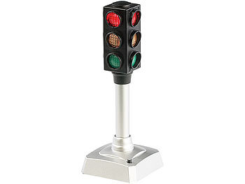
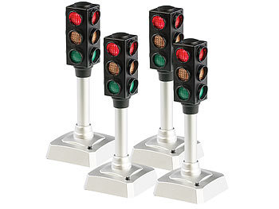
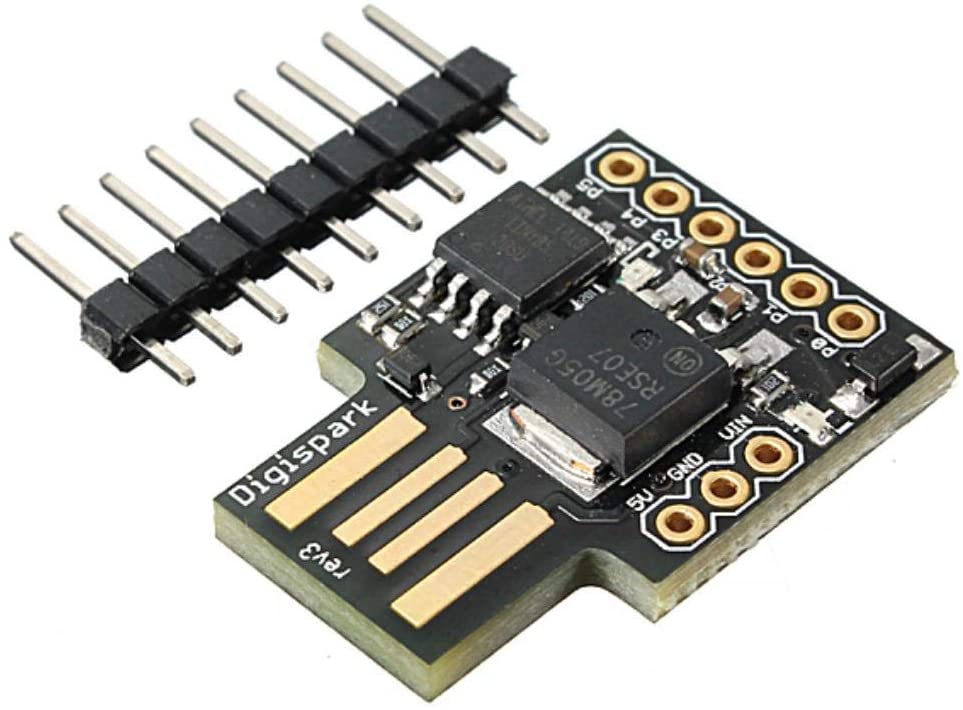

# LowCostUsbStatusLight
This repository provides the code basis and the step-by-step guide how to build a low-cost Arduino-based USB-controllable status light.

The build cost is **around 10 €**.

The LED hardware is based on cheap LED traffic lights with red/yellow/green LEDs available on a German online store called [PEARL](https://www.pearl.de/):

| Name                  | LED-Verkehrsampel,  batteriebetrieben, blinkt auf Knopfdruck | LED Verkehrsampel 4er-Set                         |
| --------------------- | ------------------------------------------------------------ | ------------------------------------------------- |
| Order code            | NC-2046-903                                                  | NC-2047-903                                       |
| Price (as by 03/2022) | 6,90 € per piece                                             | 19,99 € for 4, ~5,00 € per piece                  |
| Picture               |             |  |

It's is a manually controllable, battery powered toy traffic light. We will remove the PCB, the battery and the push button. Basically every other cool-looking PCB or breadboard with three LEDs will do the trick.

As three LEDs alone will not work, there needs to be some microcontroller with USB connectivity and Arduino support.

[Digistump's Digispark](http://digistump.com/products/1) is an Attiny85 based microcontroller development board similar to the  Arduino line, only cheaper, smaller, and a bit less powerful:

| Digispark                                                    |
| ------------------------------------------------------------ |
|  |
| Cost is around                                               |

The board has 6 I/O Pins where 2 are used for software-USB leaving us with 4 I/O pins for connecting the three LEDs. The Digispark comes preprogrammed with a bootloader which supports flashing via USB - no in-system programmer (ISP) required!

The communication is based on a virtual COM port via a virtual USB (V-USB) device. The software implementation uses DigiCDC - the [Digispark USB CDC Serial Library](https://digistump.com/wiki/digispark/tutorials/digicdc).

The LEDs' anodes are connected to 5V VCC ("common anode"), whereas the cathodes are connected to individual microcontroller pins via individual current limiting resistors (e.g. 220 Ohms each). The LEDs can then be switched on by driving the microcontroller pins in the low state.

| Pin  | Connection                              |
| ---- | --------------------------------------- |
| D0   | Yellow LED                              |
| D1   | Red LED (and also the red on-board LED) |
| D2   | Green LED                               |

The application code is less than 100 lines, check out the [Arduino sketch](./LowCostUsbStatusLight/LowCostUsbStatusLight.ino).

In order to control the LEDs via the virtual serial interface, connect to the serial port using a serial terminal (e.g. Arduino's Serial Monitor) or your favorite scripting or programming language (e.g. Python). The following single-character commands have been implemented:

| Command | Action                |
| ------- | --------------------- |
| `'r'`   | Switch red LED off    |
| `'R'`   | Switch red LED on     |
| `'y'`   | Switch yellow LED off |
| `'Y'`   | Switch yellow LED on  |
| `'g'`   | Switch green LED off  |
| `'G'`   | Switch green LED on   |
| `'a'`   | Switch all LEDs off   |
| `'A'`   | Switch all LEDs on    |

Blinking sequences are currently not supported and need to be implemented on the sender side of the serial interface (e.g. your Python script).

Questions? Feel free to ask, also via twitter: [@maehw](https://twitter.com/maehw)

Please also let me know about your integrations...

